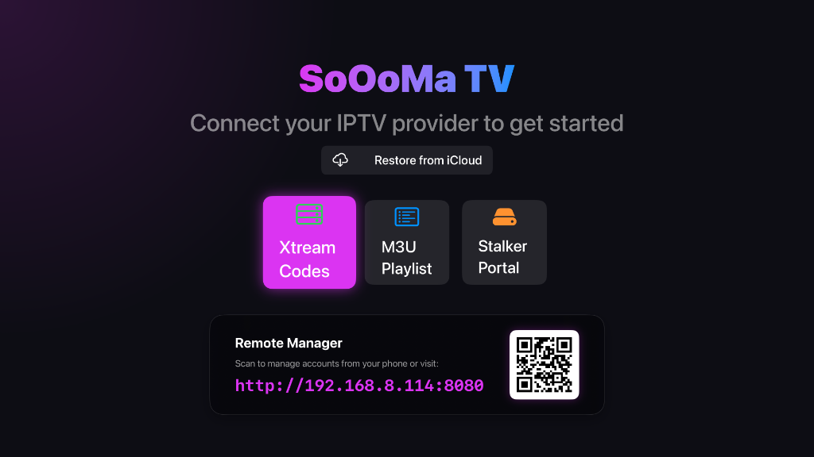
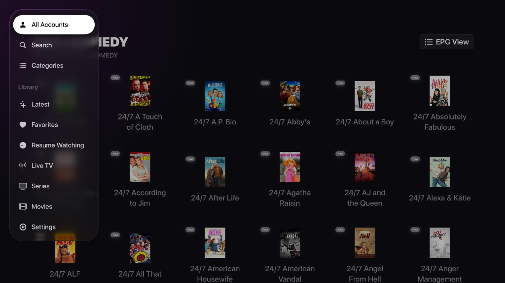
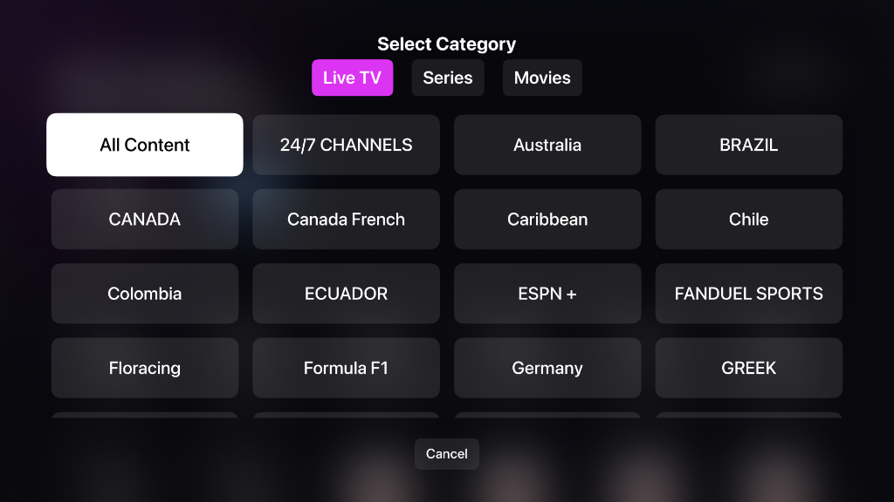
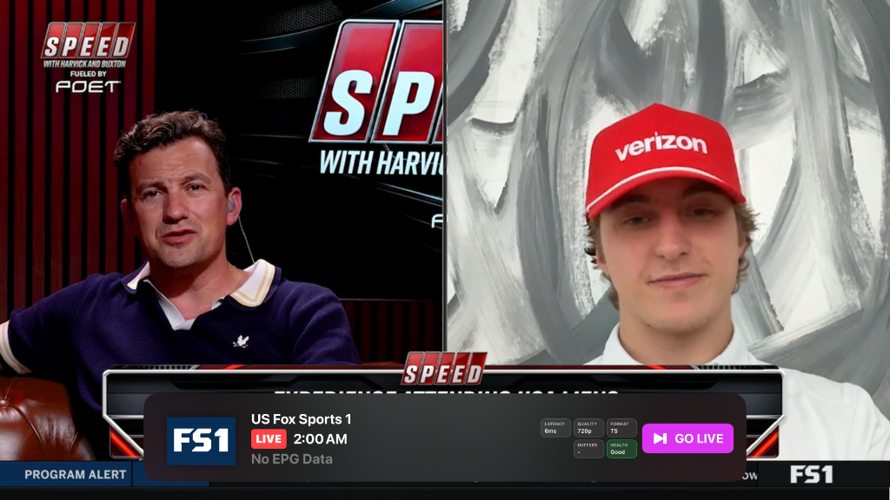

  <h1>SoOoMa TV Support</h1>
  

    <strong>Welcome to the official support and feedback page for SoOoMa TV on Apple TV.</strong>
  

---

If you are experiencing any issues with the app, or if you have an idea for a new feature, you are in the right place! We use GitHub Issues to track and manage all of our support tickets.

## 🎫 How to Submit a Support Ticket

To get help, please submit a ticket by following these steps:

1. **Click the link below** to open the ticket submission page.
2. Choose either **Bug report** (if something isn't working right) or **Feature request** (if you have a suggestion).
3. Fill out the provided form with as much detail as possible. If you are reporting a bug, please be sure to include your Apple TV model and tvOS version so we can reproduce it.
4. Click the green **Submit new issue** button.

👉 **[Click Here to Submit a Support Ticket](https://github.com/SeMoOo/SoOoMa-TV-Support/issues/new/choose)**

Our support team will review your ticket and reply to you directly on the issue page as soon as possible!

---

## 📸 App Previews

| Startup & Login | Home Dashboard | Category Selection | Video Player & EPG |
|:---:|:---:|:---:|:---:|
|  |  |  |  |
